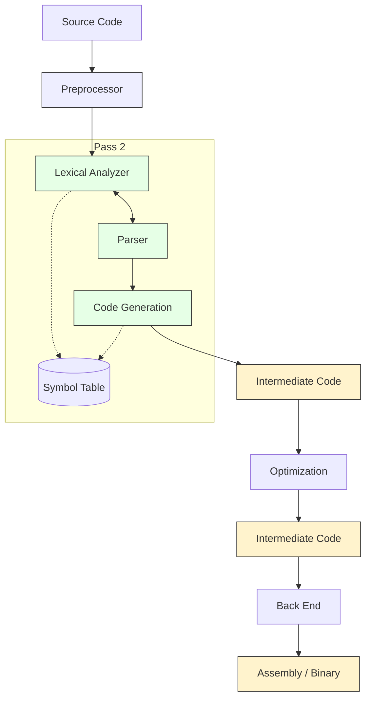

```mermaid
flowchart TD
    classDef pass fill:#eef,stroke:#333,stroke-width:1px;
    classDef core fill:#e6ffe6,stroke:#333;
    classDef data fill:#fff3cd,stroke:#333;

    A[Source Code] --> B[Preprocessor]
    class B pass

    subgraph Pass 2
        C[Lexical Analyzer]
        D[Parser]
        E[Code Generation]
        F[(Symbol Table)]
    end

    B --> C
    C <--> D
    D --> E
    C -.-> F
    E -.-> F

    E --> G[Intermediate Code]
    G --> H[Optimization]
    H --> I[Intermediate Code]
    I --> J[Back End]
    J --> K[Assembly / Binary]

    class C,D,E core
    class G,I,K data
```
